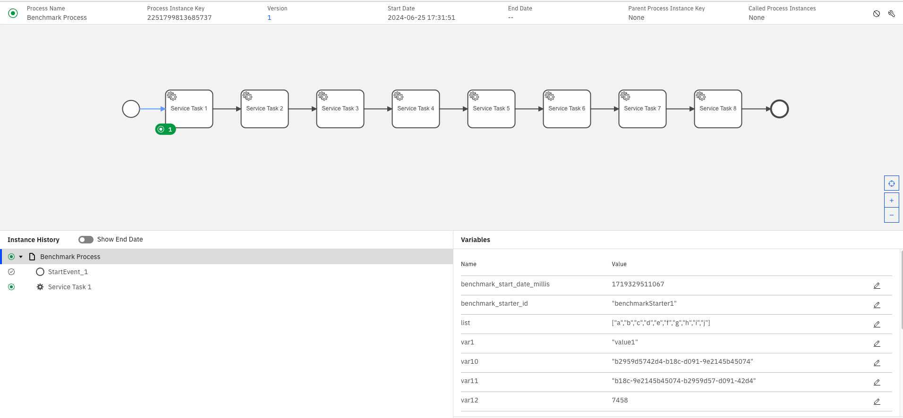
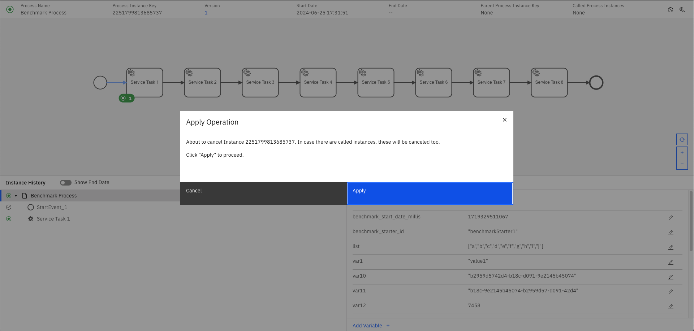
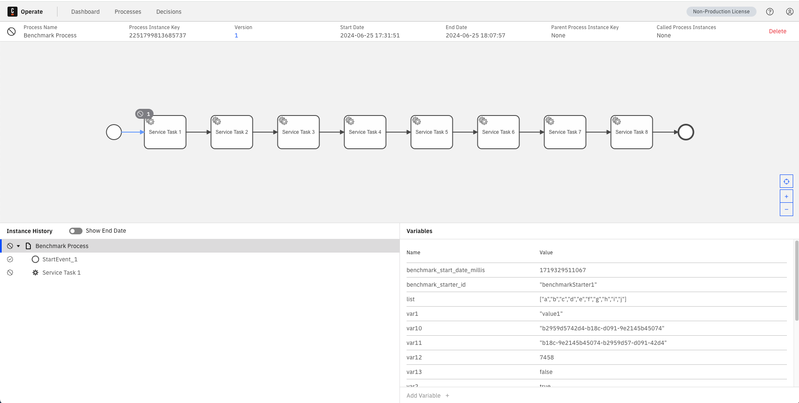

# Trigger Backup and Restore

## Create Demo Environment

### Create Minio

```bash
helm install minio oci://registry-1.docker.io/bitnamicharts/minio -f minio-values.yaml
```

### Install Camunda

```bash
helm install camunda camunda/camunda-platform -f camunda-values.yaml --version 9.3.6
```

### Wait for ES to be ready
```bash
kubectl rollout status sts/camunda-elasticsearch-master
```

### Register Snapshot Repositories
```bash
kubectl apply -f es-snapshot-minio-job.yaml
```

```bash
kubectl logs -f $(kubectl get pods --selector=job-name=es-snapshot-minio-job --output=jsonpath='{.items[*].metadata.name}' | awk '{print $1}') 
```

### Generate Data

```bash
kubectl create configmap models --from-file=CamundaProcess.bpmn=./backup/BenchmarkProcess.bpmn
```

```bash
kubectl apply -f ./backup/zbctl-deploy-job.yaml 
```

```bash
kubectl logs -f $(kubectl get pods --selector=job-name=zbctl-deploy --output=jsonpath='{.items[*].metadata.name}' | awk '{print $1}') 
```

```bash
kubectl create configmap payload --from-file=./backup/payload.json
```

```bash
kubectl apply -f ./backup/benchmark.yaml
sleep 45
kubectl delete -f ./backup/benchmark.yaml
```


### Review Current State


## Perform Backup
### Generate BackupId
```bash
./backup/create-backupId-as-secret.sh
```

### Trigger Backup for Operate and Optimize

```bash
kubectl apply -f ./backup/camunda-backup-job.yaml
```

```bash
kubectl logs -f $(kubectl get pods --selector=job-name=camunda-backup-job --output=jsonpath='{.items[*].metadata.name}' | awk '{print $1}') 
```

### +++NEW+++ Backup tasklist +++NEW+++
```bash
./backup-tasklist.sh
```

### Pause Exporting

```bash
kubectl apply -f ./backup/zeebe-export-pause.yaml
```

### Backup of Zeebe Records in ES
```bash
kubectl apply -f ./backup/es-create-snapshot-zeebe.yaml
```

```bash
kubectl logs -f $(kubectl get pods --selector=job-name=es-create-snapshot-zeebe --output=jsonpath='{.items[*].metadata.name}' | awk '{print $1}') 
```

### Zeebe Backup
```bash
kubectl apply -f ./backup/zeebe-backup-job.yaml
```

```bash
kubectl logs -f $(kubectl get pods --selector=job-name=zeebe-backup-job --output=jsonpath='{.items[*].metadata.name}' | awk '{print $1}') 
```

### (Optional not required for the Demo) Resume Exporting

```bash
kubectl apply -f ./backup/zeebe-export-resume.yaml
```

## Simulate Data Loss

```bash
helm delete camunda
```

```bash
kubectl delete pvc data-camunda-elasticsearch-master-0 data-camunda-elasticsearch-master-1 data-camunda-postgresql-0 data-camunda-zeebe-0 data-camunda-zeebe-1 data-camunda-zeebe-2
```

## Restore
### Create New Camunda Cluster

```bash
helm install camunda camunda/camunda-platform -f camunda-values.yaml --version 9.3.6
```

```bash
kubectl rollout status deploy/camunda-operate
```

Why? Templates and Aliases are created again.

### Verify that Templates are generated.


### Scale Down Zeebe & Webapps.
```bash
kubectl scale sts/camunda-zeebe --replicas=0
kubectl scale deploy/camunda-zeebe-gateway --replicas=0
kubectl scale deploy/camunda-operate --replicas=0
kubectl scale deploy/camunda-tasklist --replicas=0
kubectl scale deploy/camunda-optimize --replicas=0
```

### Register ES Repositories again
```bash
kubectl delete -f es-snapshot-minio-job.yaml
kubectl apply -f es-snapshot-minio-job.yaml
```
### Delete all Indices
```bash
kubectl apply -f restore/es-delete-all-indices.yaml
```

### Restore Snapshots
```bash
kubectl apply -f restore/es-snapshot-restore-job.yaml
```

### +++NEW+++ Restore tasklist +++NEW+++

```bash
curl -s -X POST "localhost:9200/_snapshot/tasklist-backup/backup_tasklist_1_set_1/_restore" -H "Content-Type: application/json" -d "{
      \"indices\": \"tasklist-import-position-8.2.0_\",
      \"ignore_unavailable\": true,
      \"include_global_state\": false
    }"
```    

```bash
curl -s -X POST "localhost:9200/_snapshot/tasklist-backup/backup_tasklist_1_set_2/_restore" -H "Content-Type: application/json" -d "{
      \"indices\": \"tasklist-process-instance-8.3.0_,tasklist-task-8.4.0_\",
      \"ignore_unavailable\": true,
      \"include_global_state\": false
    }"
```

```bash
curl -s -X POST "localhost:9200/_snapshot/tasklist-backup/backup_tasklist_1_set_3/_restore" -H "Content-Type: application/json" -d "{
      \"indices\": \"tasklist-task-8.4.0_*,-tasklist-task-8.4.0_\",
      \"ignore_unavailable\": true,
      \"include_global_state\": false
    }"
```

```bash
curl -s -X POST "localhost:9200/_snapshot/tasklist-backup/backup_tasklist_1_set_4/_restore" -H "Content-Type: application/json" -d "{
      \"indices\": \"tasklist-flownode-instance-8.3.0_,tasklist-variable-8.3.0_,tasklist-draft-task-variable-8.3.0_,tasklist-task-variable-8.3.0_\",
      \"ignore_unavailable\": true,
      \"include_global_state\": false
    }"
```

```bash
curl -s -X POST "localhost:9200/_snapshot/tasklist-backup/backup_tasklist_1_set_5/_restore" -H "Content-Type: application/json" -d "{
      \"indices\": \"tasklist-draft-task-variable-8.3.0_*,-tasklist-draft-task-variable-8.3.0_,tasklist-task-variable-8.3.0_*,-tasklist-task-variable-8.3.0_\",
      \"ignore_unavailable\": true,
      \"include_global_state\": false
    }"
```

```bash
curl -s -X POST "localhost:9200/_snapshot/tasklist-backup/backup_tasklist_1_set_6/_restore" -H "Content-Type: application/json" -d "{
      \"indices\": \"tasklist-form-8.4.0_,tasklist-metric-8.3.0_,tasklist-migration-steps-repository-1.1.0_,tasklist-process-8.4.0_,tasklist-web-session-1.1.0_,tasklist-user-1.4.0_\",
      \"ignore_unavailable\": true,
      \"include_global_state\": false
    }"
```


### Restore Zeebe
```bash
kubectl apply -f restore/zeebe-restore-job-0.yaml
```

```bash
kubectl logs -f $(kubectl get pods --selector=job-name=zeebe-restore-job-0 --output=jsonpath='{.items[*].metadata.name}' | awk '{print $1}') 
```

```bash
kubectl apply -f restore/zeebe-restore-job-1.yaml
```

```bash
kubectl logs -f $(kubectl get pods --selector=job-name=zeebe-restore-job-1 --output=jsonpath='{.items[*].metadata.name}' | awk '{print $1}') 
```

```bash
kubectl apply -f restore/zeebe-restore-job-2.yaml
```

```bash
kubectl logs -f $(kubectl get pods --selector=job-name=zeebe-restore-job-2 --output=jsonpath='{.items[*].metadata.name}' | awk '{print $1}') 
```

```bash
kubectl delete jobs zeebe-restore-job-0 zeebe-restore-job-1 zeebe-restore-job-2
```

### Scale up Zeebe again
```bash
kubectl scale sts/camunda-zeebe --replicas=3
```

```bash
kubectl rollout status sts/camunda-zeebe
```

```bash
kubectl scale deploy/camunda-zeebe-gateway --replicas=1
```

```bash
kubectl port-forward svc/camunda-zeebe-gateway 26500
```

```bash
zbctl status --insecure
```

### Scale up Operate again
```bash
kubectl scale deploy/camunda-operate --replicas=1
```
### Scale up Tasklist again
```bash
kubectl scale deploy/camunda-tasklist --replicas=1
```
### Scale up Optimize again
```bash
kubectl scale deploy/camunda-optimize --replicas=1
```

# Validate Restore

## Operate:


## Zeebe:
### Find an active Instance



### Cancel it via Operate UI



### Validate Cancellation


# Cleanup
```bash
helm uninstall camunda
```

```bash
helm uninstall minio
```

```bash
kubectl delete jobs $(kubectl get jobs --no-headers -o custom-columns=":metadata.name,:status.conditions[?(@.type=='Complete')].status" | grep True | cut -d" " -f1)
```
```bash
kubectl delete pvc data-camunda-elasticsearch-master-0 data-camunda-elasticsearch-master-1 data-camunda-postgresql-0 data-camunda-zeebe-0 data-camunda-zeebe-1 data-camunda-zeebe-2 minio
```
